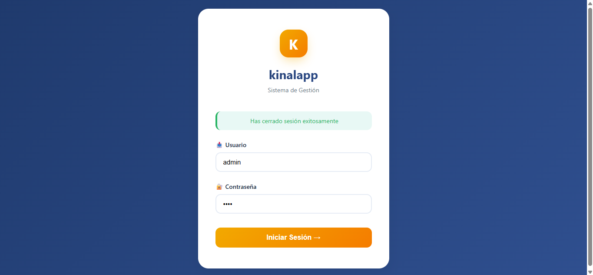
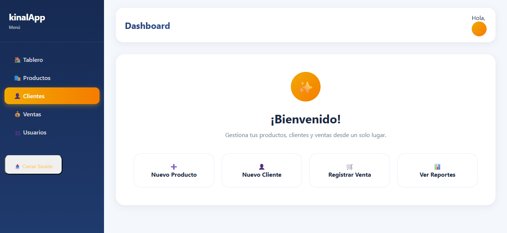
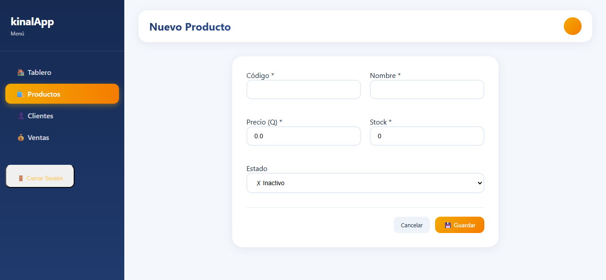
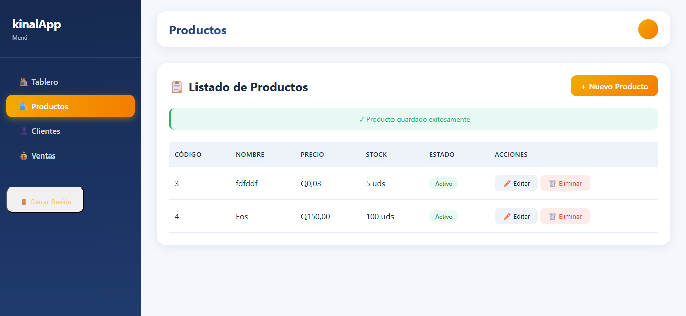

# kinalapp - 2022166
Descripción:  
kinalapp es una API REST desarrollada con Spring Boot que permite la gestión de diferentes entidades como clientes, productos, usuarios, ventas y detalle de ventas. El sistema implementa operaciones CRUD completas y cuenta con autenticación mediante Spring Security para el acceso seguro a los endpoints.

## Tecnologías Utilizadas
* **Java 21**
* **Spring Boot 4.0.2**
* **Maven** (Gestor de dependencias)
* **MySQL** (Sistema gestor de base de datos)
* **Spring Security** (Autenticación y autorización)

## Requisitos Previos
Antes de ejecutar la aplicación, debe tener instalado en su dispositivo:
* JDK 17 o superior
* Maven instalado
* Una instancia activa en MySQL
* Contar con Postman instalado (opcional, recomendado para pruebas de endpoints)

## Instalación y Ejecución
1. Clonar el repositorio de GitHub (https://github.com/ddeleon-2022166/kinalapp.git)
2. Ejecutar el IDE de su preferencia, tanto para Spring Boot como para la base de datos
3. Dentro del IDE (Spring Boot), abrir el proyecto previamente clonado
4. Como primera disposición, debe dirigirse a la configuración de la aplicación (src/main/resources/application.properties)

5. Ubicado en el archivo de configuración, encontrará lo siguiente:

* spring.datasource.url=jdbc:mysql://localhost:3306/dbClientes_in5am?createDatabaseIfNotExist=true  
  (Esto creará la base de datos automáticamente. Para su correcto funcionamiento, asegúrese de que MySQL esté en ejecución)

* spring.datasource.username=IN5AM  
  (Corresponde al usuario de su instancia de MySQL. Debe ajustarlo según su configuración)

* spring.datasource.password=Kinal@2026AM  
  (Debe colocar la contraseña correspondiente al usuario configurado en MySQL)

* server.port=8081  
  (Define el puerto en el que se ejecutará la aplicación)

6. Una vez realizado lo anterior, deberá ejecutar la aplicación. El proyecto cuenta con Spring Security, por lo que, para poder acceder a cada endpoint, deberá crear un usuario siguiendo el siguiente flujo:

* En la clase main verá:  
  BCryptPasswordEncoder encoder = new BCryptPasswordEncoder();  
  System.out.println(encoder.encode("1234"));  
  (El valor dentro de "1234" representa la contraseña a encriptar)

* Al ejecutar la aplicación, se generará un hash en la consola del IDE (Ej: $2a$10$hhtfgLfK9fK87DeVc7MKN.bW8Vu54...)

* La base de datos y sus respectivas tablas se crean automáticamente al iniciar la aplicación. Luego, en su gestor de base de datos, ejecutar:  
  use dbclientes_in5am;

* Posteriormente, insertar un usuario mediante:  
  INSERT INTO usuarios (codigo_usuario, username, password, email, rol, estado)
  VALUES (1, 'admin', 'AQUI_EL_HASH_GENERADO', 'correo@ejemplo.com', 'ROL', 1);

7. Ahora, en base al puerto (véase en el paso 5), en su navegador de preferencia deberá ingresar en el buscador:  
   http://localhost:8081

8. Esto lo llevará a un formulario de inicio de sesión, donde deberá ingresar el nombre y la contraseña del usuario previamente creado

9. Una vez haya iniciado sesión, se le redigira al menú principal de la aplicación, donde tendra a su disponibilidad el CRUD correspondiente a cada entidad.

10. Al ingresar a cualquiera de las secciones presentadas en la imagen, tendra la opción de crear un elemento, según corresponda a la entidad (supongamos, Producto).

11. Una vez creado un elemento, tendra la opcion de modificar o eliminar el mismo, según lo requiera la situación.

12. Esto aplica a todas las entidades (Productos, Clientes, Ventas y Usuarios). En caso de que haya finalizado, puede cerrar sesión directamente desde la aplicación.

13. ¡Muchas Gracias!
